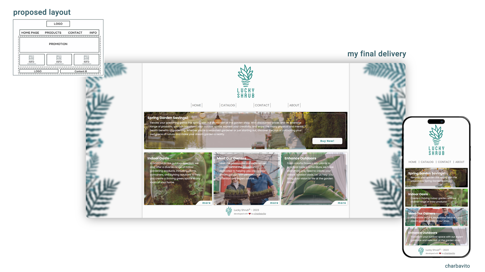
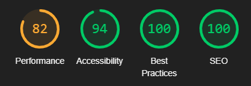

    

<h1 align='center'>Meta Frontend Specialization - Final assingment for Course 04</h1>

    <h2>
      <a href='https://lucky-shrub-website-black.vercel.app/' target="_blank"> Live Version at Versel </a>
    </h2>

## <strong>The Challenge</strong>
This is the final work for the Meta Frontend Specialization Course o4 (HTML and CSS in Depth). The goal was, given a basic layout (proposed layout on above image), we should both create a beautiful design for a fictitious company and also implement the HTML and CSS codes in a semantic and responsive way.

## <strong>Technology Used</strong>

    &nbsp; 
    &nbsp;
    &nbsp;
    &nbsp; 
    &nbsp; 
    &nbsp; 
    &nbsp; 
    

## <strong>My Process</strong>
- I started with artistic decisions, developing the design of the project through the Adobe XD tool.
- With the layout finished, I started to analyze and plan the structure of the initial content in HTML and at the same time thinking about some styling strategies in CSS that I would adopt.
- With the planning of the initial content finalized, I was able to start structuring the HTML content in a semantic way and already inserting the main classes necessary for future styling.
- Once the basic structure in HTML was finished, I was able to move on to the styling. For this project I used the SCSS Preprocessor. This styling phase was the longest in the process, as I had to review and research many CSS concepts to achieve the results I needed.
- With the styling almost finished I started to generate the texts. In this phase I used chatGPT to generate all the texts, both for the desktop version and for the mobile version.
- When I finished all the texts I could finalize the styling by adjusting the sizes, spacing and inserting the interactions, mainly through the hover pseudo-class.
- At this point I already had the project completed in terms of HTML and CSS, both for the desktop and mobile versions. With these two files ready, I used the w3 validation tool to ensure code quality as well as browser extensions to ensure good page performance.
- I made the necessary adjustments to achieve acceptable quality and performances and finalized the project.
- From that point on, I started editing the README and prepared the file to push it to the remote repository on Github and create the project's deployment on Versel.

### <strong>What I learned</strong>
This was the most challenging project I've done so far. Mainly because I ran it from layout creation in Adobe Xd to its final implementation in Versel and was therefore responsible for all design and implementation decisions. In it I was able to put into practice everything I have been learning in recent months.
Despite only using HTML and CSS, numerous elements were challenging, especially with regard to styling and I had to learn new concepts to achieve the final result, such as: <b>clip path, svg, new pseudo-classes, transitions, among many other concepts</b>

### <strong>Useful resources</strong>
- [ChatGPT](https://openai.com/blog/chatgpt) - For text content
- [Pexels](https://www.pexels.com/) - For CC0 excelent quality images
- [W3School References](https://www.w3schools.com/) - References to CSS and HTML 
- [MDN References](https://developer.mozilla.org/en-US/) - References to CSS and HTML 
- [W3C Markup Validation Service](https://validator.w3.org/#validate_by_input) - HTML5 and CSS3 code compliance check
- [Lighthouse Performance Check](https://developer.chrome.com/docs/lighthouse/overview/) - Google extension to check site metrics of performance, SEO, etc.
  
 

    

 

## <strong>Acknowledgments</strong>
I am very grateful to Coursera for funding this Specialization as well as all the artists who make wonderful images available for free on Pexels. I also indirectly thank all the people who responded in the forums where I could find tips to continue solving my code problems.

